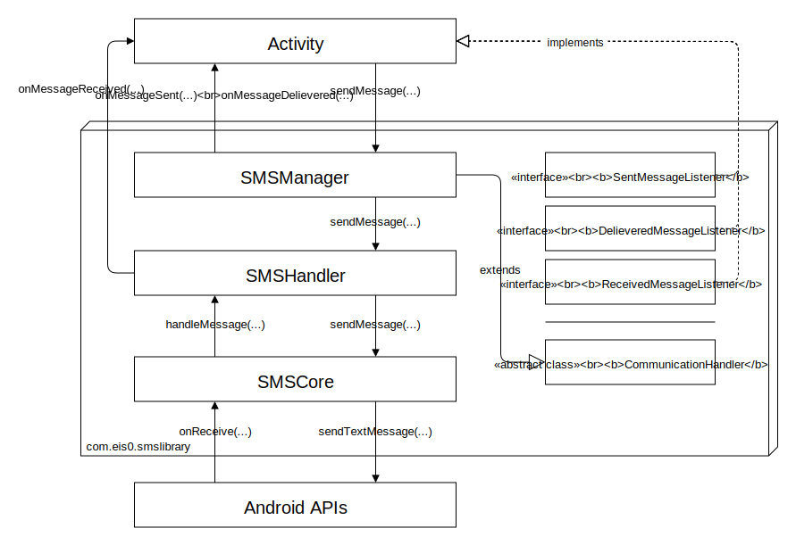

# SMS Library
This repository contains an Android Studio project with two modules:
* The library module: It contains the library itself
* The demo module: It contains a basic demo activity for demonstrating the library functionalities
## Library
The library has the following essential structure (updated 5-11-2019):

## Demo
The demonstration is a simple app that allows the user to send fixed messages to another phone containg an "hello".
Two phones with the demo app can communicate in this way.
